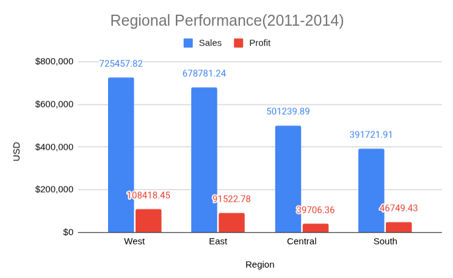
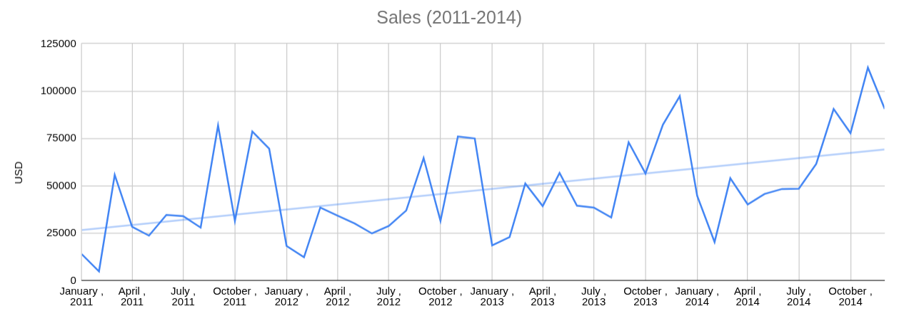
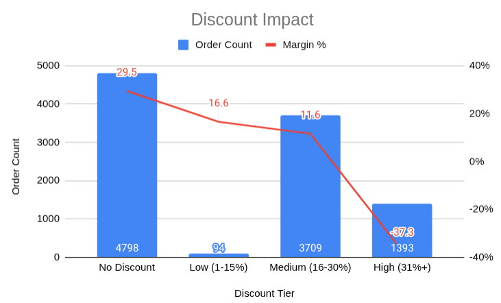
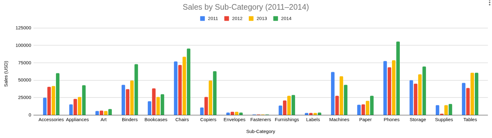

# SQL Practice — Superstore Dataset

A collection of SQL query exercises using SQLite to practice database operations on a sample retail dataset.


## Dataset Overview

| Parameter | Value |
|-----------|-------|
| Source | [Superstore Sales Dataset](https://www.kaggle.com/datasets/ishanshrivastava28/superstore-sales) (Kaggle) |
| Period | 2011–2014 |
| Records | ~9,900 rows |
| Tool | SQLite (DB Browser for SQLite) |


## Exercises

### Q1: Regional Performance

**Business Question:** Which regions drive the most sales and profit, and what's the profit margin for each?

<details><summary>View SQL Query(expand)</summary>
  
```
SELECT
	Region, 
	SUM(Sales) AS total_sales, 
	SUM(Profit) AS total_profit,
	ROUND(SUM(Profit) / SUM(Sales) * 100 , 1) AS  profit_margin
FROM
	Superstore
GROUP BY
	Region
ORDER BY total_sales DESC;
```
</details>
<details>
<summary>View Chart (expand)</summary>



</details>


**Key Findings:**
- West leads in both sales ($725K) and profit ($108K).
- East follows closely in sales but trails in profit.
- Central region shows disproportionately low profit relative to its sales volume.

**Insight:** Central underperforms on margin despite moderate sales. Investigate cost structures or product mix in this region. West should be the benchmark for regional strategy.

---
### Q2: Monthly Trends

**Business Question:** How do sales trend over time at monthly granularity?

<details><summary>View SQL Query (expand)</summary>

```  
WITH monthly_sales AS (
    SELECT 
        strftime('%Y-%m', "Order Date") AS month,
        SUM(Sales) AS monthly_total
    FROM Superstore
    GROUP BY month
)
SELECT 
    month,
    ROUND(monthly_total, 2) AS monthly_total,
    ROUND(LAG(monthly_total) OVER (ORDER BY month), 2) AS prev_month,
    ROUND(
        (monthly_total - LAG(monthly_total) OVER (ORDER BY month)) 
        / LAG(monthly_total) OVER (ORDER BY month) * 100, 
        1
    ) AS growth_pct
FROM monthly_sales
ORDER BY month ASC;
```
</details>
<details><summary>View Chart (expand)</summary>



</details>

**Key Findings:**
- Strong seasonal pattern: Q4 peaks, Q1 troughs, consistent across all four years.
- Each year outperforms the previous — overall growth trajectory is positive.
- 2014 shows the strongest Q4 peak on record.

**Insight:** Revenue is concentrated in Q4. Procurement and staffing should scale up in Q3; promotional spend could target Q1 to offset the seasonal dip.

---
### Q3: Discount Tier Impact

**Business Question:** Do higher discounts drive more orders or erode margins?

<details><summary>View SQL Query (expand)</summary>
  
```
SELECT
	CASE
		WHEN Discount = 0 THEN 'No Discount'
		WHEN Discount <= 0.15 THEN 'Low (1-15%)'
		WHEN Discount <= 0.30 THEN 'Medium (16-30%)'
		ELSE 'High (31%+)'
	END AS discount_tier,
	COUNT(*) AS order_count,
	ROUND(AVG(Sales), 2) AS avg_order_value,
	ROUND(SUM(Profit) / SUM(Sales) * 100, 1) AS weighted_margin_pct,  
    ROUND(SUM(Sales) * 100.0 / (SELECT SUM(Sales) FROM Superstore), 1) AS revenue_share_pct 
FROM Superstore
GROUP BY discount_tier
ORDER BY 
	CASE discount_tier
		WHEN 'No Discount' THEN 1
        WHEN 'Low (1-15%)' THEN 2
        WHEN 'Medium (16-30%)' THEN 3
        WHEN 'High (31%+)' THEN 4
    END
```
</details>
<details><summary>View Chart (expand)</summary>



</details>

**Key Findings:**
- Margin stays healthy at No Discount (29.5%) and Medium tiers (11.6%).
- Margin turns sharply negative at Heavy discounts (-37.8% for 30%+).
- Order volume is concentrated in No Discount and Medium tiers (8,500+ orders combined).

**Insight:** Discounts above 25% actively destroy profitability — customers in this tier cost the company money on each sale. Promotional spend should be capped at 20–25%, or paired with minimum order requirements to offset margin erosion.

---
### Q4: Sub-Category YoY Growth

**Business Question:** Which sub-categories are growing or shrinking year-over-year?

<details><summary>View SQL Query (expand)</summary>
  
```
WITH yearly_sales AS (
    SELECT 
        "Sub-Category",                          
        strftime('%Y', "Order Date") AS year,
        ROUND(SUM(Sales), 2) AS yearly_sales
    FROM Superstore
    GROUP BY "Sub-Category", year                 
),
ranked_sales AS (
    SELECT 
        "Sub-Category",
        year,
        yearly_sales,
        LAG(yearly_sales) OVER (PARTITION BY "Sub-Category" ORDER BY year) AS prev_year_sales
    FROM yearly_sales
)
SELECT 
    "Sub-Category",
    year,
    yearly_sales,
    prev_year_sales,
    yearly_sales - prev_year_sales AS sales_difference,
    ROUND((yearly_sales - prev_year_sales) / prev_year_sales * 100, 1) AS pct_change
FROM ranked_sales;
```

</details>
<details><summary>View Chart (expand)</summary>



</details>

**Key Findings:**
- Phones and Chairs lead in absolute sales volume (~$75K–$100K/year in recent years).
- Most sub-categories show steady growth from 2011–2014, with notable acceleration post-2012.
- Supplies, Binders, and Phones show the strongest upward trajectory.
- Fasteners, Labels, and Art remain consistently low-volume throughout the period.

**Insight:** Investment should prioritize high-growth sub-categories (Phones, Storage, Binders) which have proven momentum. Low-volume categories (Fasteners, Labels) warrant review — either reposition for niche demand or consolidate inventory.

---
## Skills Demonstrated

- `LAG()` for time-based comparisons
- CTE chaining for multi-step aggregation
- `PARTITION BY` with window functions
- `CASE` for conditional categorization
- `strftime()` for date extraction
- Weighted margin calculation (`SUM(x)/SUM(y)`)
